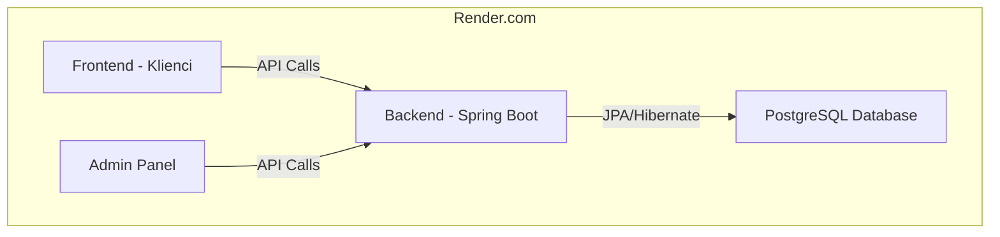
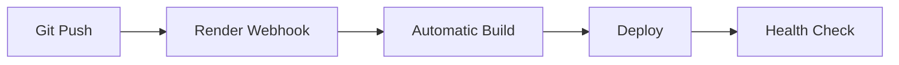

# 🚗 Rentiva - Platforma Wynajmu Samochodów


**Rentiva** to nowoczesna platforma do wynajmu samochodów premium, składająca się z backendu API, strony głównej dla klientów oraz panelu administracyjnego.

---

## 🏗️ Architektura systemu



---

## 📦 Komponenty

| Komponent | Technologia | Port (dev) | URL (prod) |
|-----------|-------------|------------|------------|
| **Backend** | Spring Boot 3.5 + PostgreSQL | 8081 | `rentiva-backend.onrender.com` |
| **Frontend** | React 19 + Vite | 5173 | `rentiva-frontend.onrender.com` |
| **Admin** | React 19 + Material-UI | 3001 | `rentiva-admin.onrender.com` |

---

## 🚀 Szybki start - Wdrożenie

### 1. 🔥 Szybka instrukcja (15 minut)
```bash
📄 QUICK-DEPLOY.md
```

### 2. 📚 Pełna instrukcja (krok po kroku)
```bash
📄 DEPLOYMENT.md
```

### 3. ⚙️ Konfiguracja zmiennych
```bash
📄 ENVIRONMENT-CONFIG.md
```

---

## 💻 Uruchomienie lokalne

### Wymagania
- Java 23+
- Node.js 18+
- MySQL/PostgreSQL
- Git

### Backend
```bash
cd backend
./mvnw spring-boot:run
```

### Frontend
```bash
cd frontend
npm install
npm run dev
```

### Admin Panel
```bash
cd admin
npm install
npm run dev
```

---

## 🔧 Konfiguracja deweloperska

### Backend (application.properties)
```properties
spring.datasource.url=jdbc:mysql://localhost:3306/rentiva_db
spring.datasource.username=root
spring.datasource.password=your_password
server.port=8081
```

### Frontend (.env)
```env
VITE_API_URL=http://localhost:8081/api
```

### Admin (.env)
```env
VITE_API_URL=http://localhost:8081/api
```

---

## 📋 Funkcjonalności

### 👤 Frontend (Klienci)
- [x] Przeglądanie dostępnych samochodów
- [x] Szczegóły pojazdu
- [x] System rezerwacji
- [x] Kontakt i współpraca
- [x] Responsywny design

### 🛠️ Admin Panel
- [x] Zarządzanie flotą samochodów
- [x] Dodawanie/edycja pojazdów
- [x] Upload zdjęć
- [x] Dashboard z statistykami
- [x] System autoryzacji

### 🔧 Backend API
- [x] REST API endpoints
- [x] CRUD operacje na samochodach
- [x] Upload plików
- [x] CORS configuration
- [x] Walidacja danych

---

## 🛡️ Bezpieczeństwo

- [x] **CORS**: Skonfigurowane dla produkcji
- [x] **Validation**: Walidacja danych po stronie serwera
- [x] **Environment Variables**: Wrażliwe dane w zmiennych środowiskowych
- [x] **HTTPS**: Automatyczne SSL na Render.com

---

## 📈 Performance & Monitoring

### Render.com Metryki
- **Backend**: Health check endpoint `/health`
- **Database**: PostgreSQL z automatic backups
- **CDN**: Static assets served via Render CDN
- **Logging**: Centralized logs in Render dashboard

### Optymalizacje
- **Frontend**: Vite bundling + code splitting
- **Backend**: JPA query optimization
- **Database**: Proper indexing
- **Caching**: Browser caching for static assets

---

## 🚨 Troubleshooting

### Najczęstsze problemy

| Problem | Rozwiązanie |
|---------|-------------|
| **502 Bad Gateway** | Sprawdź czy backend wystartował (może trwać 2-3 min) |
| **CORS Errors** | Zweryfikuj `CORS_ORIGINS` w backendzie |
| **Database Connection** | Sprawdź `DATABASE_URL` format |
| **Build Failures** | Sprawdź logi w Render dashboard |

### Przydatne komendy

```bash
# Sprawdź status API
curl https://rentiva-backend.onrender.com/health

# Sprawdź logi lokalne
./mvnw spring-boot:run --debug

# Test bazy danych
psql $DATABASE_URL
```

---

## 📊 Ograniczenia Free Tier (Render.com)

| Zasób | Limit |
|-------|--------|
| **Web Services** | 750h/miesiąc |
| **Static Sites** | Unlimited |
| **PostgreSQL** | 1GB storage |
| **Sleep after** | 15 min inactivity |
| **Cold start** | ~30 sekund |

---

## 🔄 CI/CD Pipeline

Automatyczne wdrożenie po każdym push:



---

## 🎯 Roadmap

### v1.1 (Planowane)
- [ ] System płatności
- [ ] Notyfikacje email
- [ ] Zaawansowane filtry
- [ ] API rate limiting
- [ ] Unit tests

### v1.2 (Przyszłość)
- [ ] Mobile app
- [ ] Multi-tenant support
- [ ] Advanced analytics
- [ ] Integration API
- [ ] Microservices architecture

---

## 🤝 Wkład w projekt

1. Fork projektu
2. Utwórz branch (`git checkout -b feature/amazing-feature`)
3. Commit changes (`git commit -m 'Add amazing feature'`)
4. Push to branch (`git push origin feature/amazing-feature`)
5. Otwórz Pull Request

---

## 📝 Licencja

Ten projekt jest licencjonowany pod **MIT License** - szczegóły w pliku `LICENSE`.

---

## 📞 Kontakt & Wsparcie

- **🐛 Błędy**: [GitHub Issues](https://github.com/your-username/rentiva/issues)
- **💡 Propozycje**: [GitHub Discussions](https://github.com/your-username/rentiva/discussions)
- **📧 Email**: support@rentiva.com

---

## 🎉 Status projektu


**🚀 Rentiva jest gotowa do produkcji!**

---

*Ostatnia aktualizacja: Czerwiec 2025*
